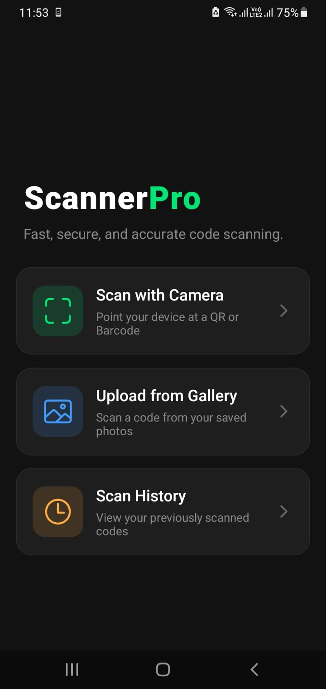
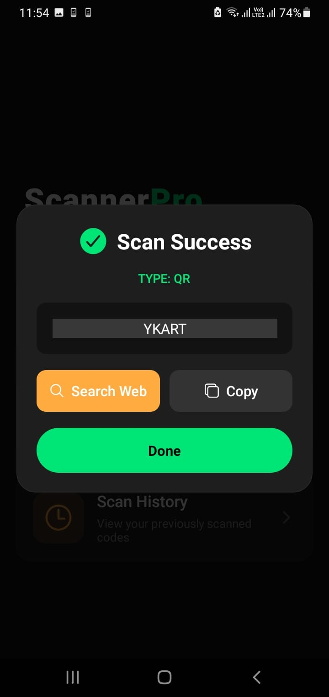
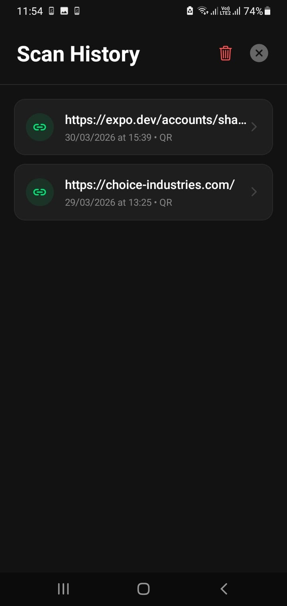

# 📱 ScannerPro


ScannerPro is a high-performance, cross-platform QR and Barcode scanning utility built with React Native and Expo. It features a custom dark-mode UI, live camera processing, static image decoding, and a persistent local history log.

## 📸 Screenshots

<p align="center">
  
  
  
</p>

<br>

## ✨ Key Features

* **Live Camera Feed Integration:** Utilizes `expo-camera` to interface with native device hardware for real-time code detection and parsing.
* **Optimized Static Image Decoding:** Includes a custom image-processing pipeline using `expo-image-manipulator` to dynamically downscale high-resolution gallery photos. This prevents native memory limit crashes (specifically within Android's MLKit) when decoding static 1D barcodes.
* **Context-Aware Smart Actions:** Employs Regex pattern matching to instantly categorize scanned data. The UI dynamically adapts to offer "Open Link" for URLs or "Search Web" for standard product barcodes.
* **Persistent Scan History:** Integrates `@react-native-async-storage/async-storage` to maintain an auto-saving log of the 50 most recent scans, complete with timestamps and defensive programming to prevent crashes from legacy or corrupted data.
* **Modern UI/UX:** Features a fully custom, responsive dark-mode interface with absolute-positioned camera overlays, interactive modals, and native clipboard integration.

## 🛠️ Tech Stack
* **Framework:** React Native / Expo
* **Camera & Media:** `expo-camera`, `expo-image-picker`
* **Image Processing:** `expo-image-manipulator`
* **Local Storage:** `@react-native-async-storage/async-storage`
* **System Utilities:** `expo-clipboard`, React Native `Linking` API
* **Icons:** `@expo/vector-icons` (Ionicons)

## 🚀 Local Development

To run this project locally on your machine:

**1. Clone the repository:**
```bash
git clone [https://github.com/shahryar-dev/QrScannerPro.git](https://github.com/shahryar-dev/QrScannerPro.git)
cd QrScannerPro